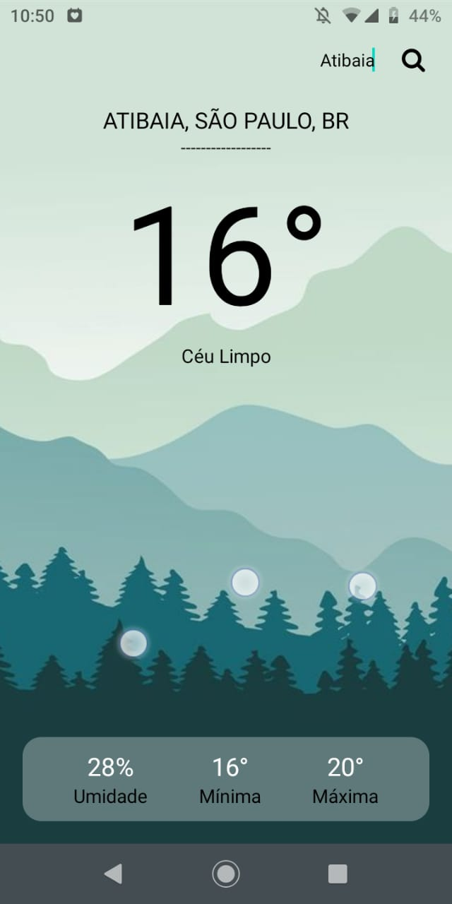
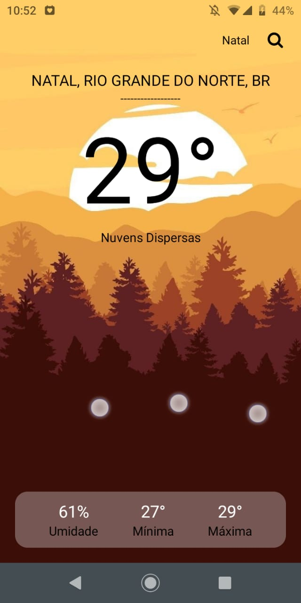
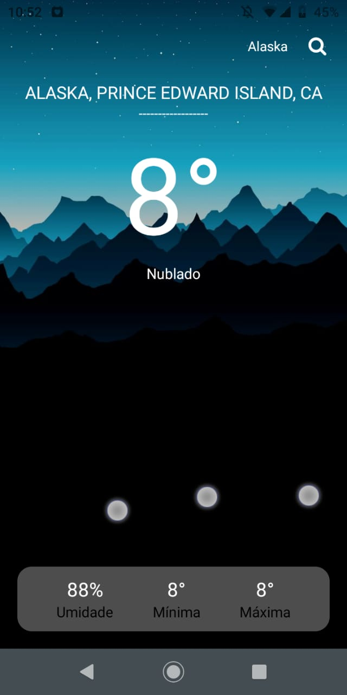

# Clima App

Aplicativo que exibe os dados atuais do clima em uma determinada região informada pelo usuário.

## Tecnologias
>
Aqui está as tecnologias usadas no projeto

 - React Native 0.69.4
 - Expo 46.0.8
 - Axios 0.27.2
 - Styled Components 5.3.5
 - TypeScript 4.3.5
 
 ## Serviços usados
  - Github

## Como usar

### Apresentação
  
  
  

## Funcionalidades

A principal funcionalidade é:
 - Exibir os dados do clima atual a partir da requisoção à API OpenWeatherApp

## Links
 - Repositório: https://github.com/Vinicius-B-Leite/Clima-app
 - Em casos de bugs, por favor me contate
  viniciusbleite21@gmail.com

## Versão
 1.0.0

## Autor
Feito com <3 por Vinicius B. Leite